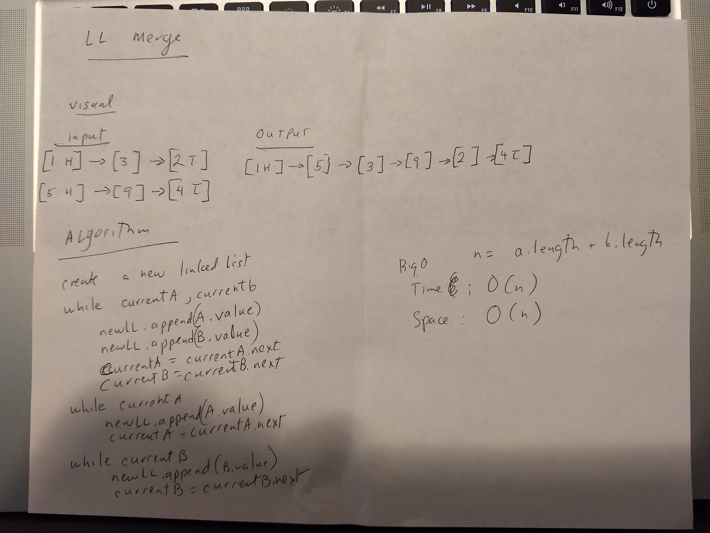
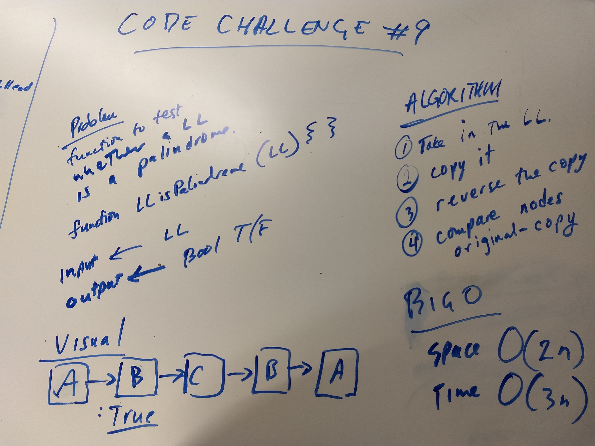
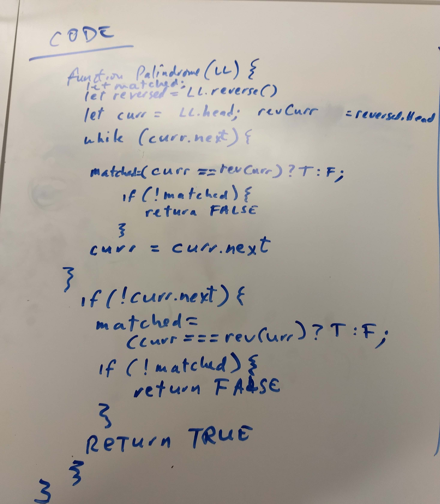
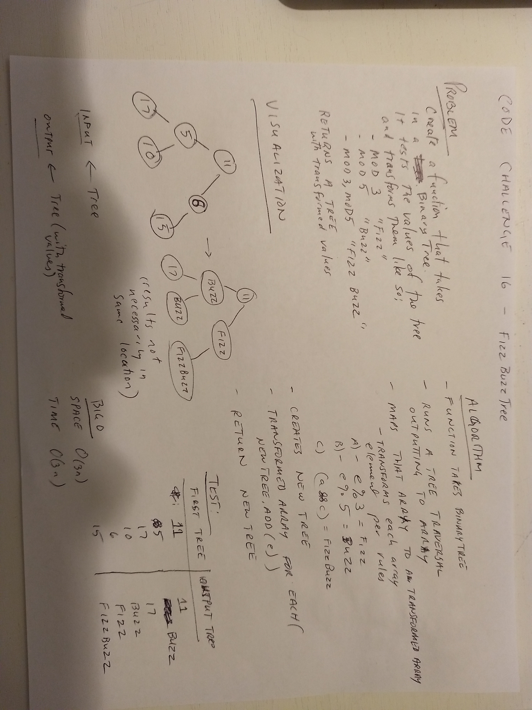
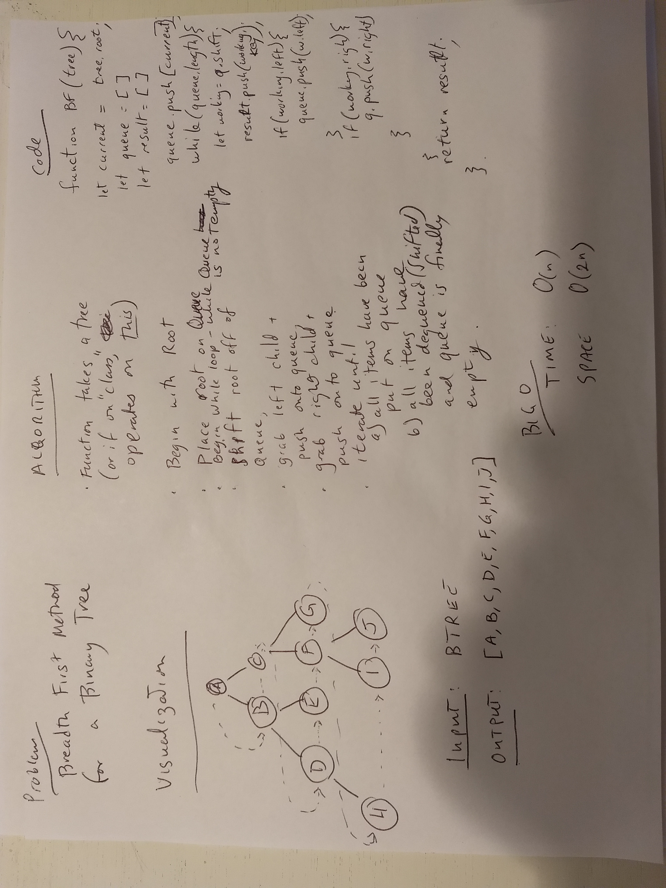
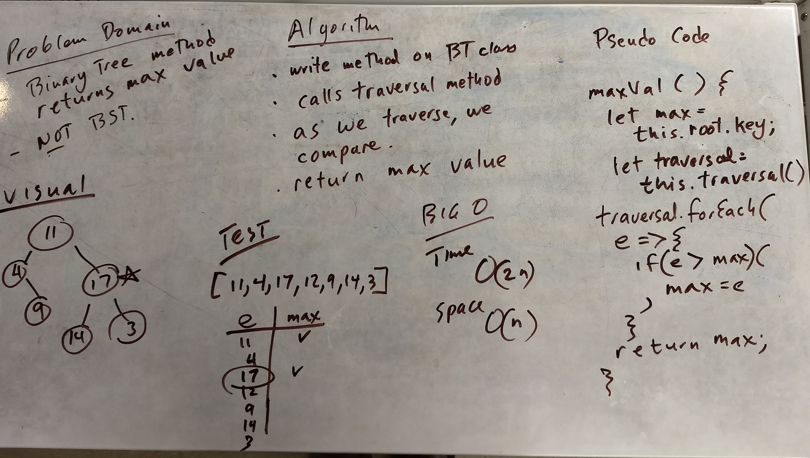

# Reverse an Array -- Code Challenge 1
<!-- Short summary or background information -->
Write a function that takes an array as input. Without utilizing any of the built-in methods, return the array values reversed.

## Challenge
<!-- Description of the challenge -->
The challenge is to avoid using built in array methods.

## Solution
<!-- Embedded whiteboard image -->

### Task List
- [x] Create GitHub repo
- [x] Build out file structure
- [x] Whiteboard 
- [x] Write actual code
- [x] Photograph image of whiteboard
- [x] Fill out README.md
- [x] Create pull request
- [x] Submit URL of PR to submit the task to Canvas

# Array Shift -- Code Challenge 2
<!-- Short summary or background information -->
Write a function called insertShiftArray which takes in an array and the value to be added. Without utilizing any of the built-in methods available to your language, return an array with the new value added at the middle index.

## Challenge
<!-- Description of the challenge -->
The challenge is to avoid using built in array methods.

## Solution
<!-- Embedded whiteboard image -->

### Task List
- [x] Create GitHub repo
- [x] Build out file structure
- [x] Whiteboard 
- [x] Write actual code
- [x] Photograph image of whiteboard
- [x] Fill out README.md
- [x] npm init -y
- [x] npm install jest, eslint
- [x] package.json scripts added
- [x] Add test framework and tests.
- [x] All tests passing including lint
- [x] Passes Travis CI build
- [x] Create pull request
- [x] Submit URL of PR to submit the task to Canvas

# Array Binary Search -- Code Challenge 3
<!-- Short summary or background information -->
Write a function that takes an ordered array and a search key as input. Without utilizing any of the built-in methods, return the index of the array’s element that is equal to the search key, or -1 if the element does not exist.

## Challenge
<!-- Description of the challenge -->
The challenge is to avoid using built in array methods, and to search in a binary way.

## Solution
<!-- Embedded whiteboard image -->

### Task List
- [x] Create GitHub repo
- [x] Build out file structure
- [x] Whiteboard 
- [x] Write actual code
- [x] Photograph image of whiteboard
- [x] Fill out README.md
- [x] npm init -y
- [x] npm install jest, faker, eslint
- [x] package.json scripts added
- [x] Add test framework and tests.
- [x] All tests passing including lint
- [x] Passes Travis CI build
- [x] Create pull request
- [ ] Submit URL of PR to submit the task to Canvas

# Linked List insert methods -- Code Challenge 6
This branch is passing tests on Travis:

<!-- Short summary or background information -->
Write three methods on your linked list class: append, insertBefore, and insertAfter.

## Solution
<!-- Embedded whiteboard image -->
 
 
 

### Task List
- [x] Create GitHub repo
- [x] Build out file structure
- [x] Whiteboard 
- [x] Write actual code
- [x] Photograph image of whiteboard
- [x] Fill out README.md
- [x] npm init -y
- [x] npm install jest, faker, eslint
- [x] package.json scripts added
- [x] Add test framework and tests.
- [x] All tests passing including lint
- [x] Passes Travis CI build
- [x] Create pull request
- [ ] Submit URL of PR to submit the task to Canvas

# Linked List k from the end -- Code Challenge 7
This branch is passing tests on Travis:

<!-- Short summary or background information -->
Write a method on your linked list class that takes a number k as a paremeter, and returns the value of the node k from then end of the linked list.

## Solution
<!-- Embedded whiteboard image -->
 

### Task List
- [x] Create GitHub repo
- [x] Build out file structure
- [x] Whiteboard 
- [x] Write actual code
- [x] Photograph image of whiteboard
- [x] Fill out README.md
- [x] npm init -y
- [x] npm install jest, faker, eslint
- [x] package.json scripts added
- [x] Add test framework and tests.
- [x] All tests passing including lint
- [x] Passes Travis CI build
- [x] Create pull request
- [x] Submit URL of PR to submit the task to Canvas

# Merge Link Lists -- Code Challenge 8

<!-- Short summary or background information -->
Write a method on your linked list class that zips two linked lists into a new linked list.

## Solution
<!-- Embedded whiteboard image -->
 

### Task List
- [x] Create GitHub repo
- [x] Build out file structure
- [x] Whiteboard 
- [x] Write actual code
- [x] Photograph image of whiteboard
- [x] Fill out README.md
- [x] npm init -y
- [x] npm install jest, faker, eslint
- [x] package.json scripts added
- [x] Add test framework and tests.
- [x] All tests passing including lint
- [x] Passes Travis CI build
- [x] Create pull request
- [x] Submit URL of PR to submit the task to Canvas

# Linked List Palindrome function -- Code Challenge 9

This one was purely a whiteboarding exercise. Images below:

## Solution
<!-- Embedded whiteboard image -->
 
 

# Stacks and Queues
Passing CI tests on Travis CI:

<!-- Short summary or background information -->
Built out Stack and Queue classes, which wrap our linked-list data structure.

## Challenge
<!-- Description of the challenge -->
Build Stacks and Queues, using Linked Lists as the underlying data structure.

## Solution
<!-- Embedded whiteboard image -->
No white board required for this challenge.

### Task List
- [x] Create GitHub repo
- [x] Build out file structure
- [x] Whiteboard
- [x] Write actual code
- [x] Photograph image of whiteboard
- [x] Fill out README.md
- [x] npm init -y
- [x] npm install jest, faker, eslint
- [x] package.json scripts added
- [x] Add test framework and tests.
- [x] All tests passing including lint
- [x] Passes Travis CI build
- [x] Create pull request
- [x] Submit URL of PR to submit the task to Canvas

# Queues With Stacks
Passing CI tests on Travis:

## Challenge
<!-- Description of the challenge -->
Build a Queue using Stacks as its underlying data structure.

## Solution
<!-- Embedded whiteboard image -->
 
 

### Task List
- [x] Create GitHub repo
- [x] Build out file structure
- [x] Whiteboard
- [x] Write actual code
- [x] Photograph image of whiteboard
- [x] Fill out README.md
- [x] npm init -y
- [x] npm install jest, faker, eslint
- [x] package.json scripts added
- [x] Add test framework and tests.
- [x] All tests passing including lint
- [x] Passes Travis CI build
- [x] Create pull request
- [x] Submit URL of PR to submit the task to Canvas

# FIFO Animal Shelter
<!-- Short summary or background information -->
An animal shelter takes in animals. And gives them out to new pet owners. A pet owner can prefer a dog or a cat, have no preference, or prefere a different animal such as a bird. If the pet owner would like a dog or a cat, find the dog or cat, if any, that has been in the shelter the longest. Otherwise, give them the animal that has been in the shelter the longest.

## Challenge
<!-- Description of the challenge -->
Using FIFO queues, return the desired animal. You can't necessarily just return the animal at the front of the queue though.

## Solution
<!-- Embedded whiteboard image -->
 

### Task List
- [x] Create GitHub repo
- [x] Build out file structure
- [x] Whiteboard
- [x] Write actual code
- [x] Photograph image of whiteboard
- [x] Fill out README.md
- [x] npm init -y
- [x] npm install jest, faker, eslint
- [x] package.json scripts added
- [x] Add test framework.
- [] Add tests.
- [] All tests passing including lint
- [] Passes Travis CI build
- [x] Create pull request
- [x] Submit URL of PR to submit the task to Canvas

# Multi Bracket Validation -- Code Challenge 13

Please note that tests for Multi Bracket Validation are passing. 

<!-- Short summary or background information -->
Write a method that tests whether a string with brackets {},[],() has all matching brackets, or not. Method takes a string and returns a boolean.

## Solution
<!-- Embedded whiteboard image -->
 
 
 

### Task List
- [x] Create GitHub repo
- [x] Build out file structure
- [x] Whiteboard 
- [x] Write actual code
- [x] Photograph image of whiteboard
- [x] Fill out README.md
- [x] npm init -y
- [x] npm install jest, faker, eslint
- [x] package.json scripts added
- [x] Add test framework and tests.
- [x] All tests passing including lint
- [x] Passes Travis CI build
- [x] Create pull request
- [x] Submit URL of PR to submit the task to Canvas

# Trees -- 

<!-- Short summary or background information -->
Build Binary Tree and a Binary Search Tree classes with transversal methods. 

## Approach & Efficiency
<!-- What approach did you take? Why? What is the Big O space/time for this approach? -->
I created a node class to support both the Binary Tree and the Binary Search Tree classes. Unlike the Node class for Linked Lists, this node class has left and right properties which are pointers to child nodes, as well as a key property which holds the value. I named my class BtNode to differentiate it from the Linked List nodes.

I created a Binary Tree Class first, and placed all methods that would work for both a regular Binary Tree and a Binary Search Tree, on the Binary Tree Class. 

I created the Binary Search Tree class to extend the Binary Tree Class. On the BST class I only put methods specific to it. 

Notes on Big O can be found in the section below.

## API
<!-- Description of each method publicly available in each of your trees -->

The Binary Tree class contains the following public methods:

getTreeCount() -- returns this.Count

getRootNode() -- returns this.root;

add() -- note that this calls an internal insertNode() method. Note that the BT insertNode() method attempts to balance out the tree by using a coin toss to determine whether child nodes are searched for to the left or right of fully populated nodes.

maxVal() -- because a BT isn't ordered, this method has to search all nodes for a Big O for time of O(n).

minVal() -- because a BT isn't ordered, this method has to search all nodes for a Big O for time of O(n).

traversal methods:

inOrder() -- note that when used by a BST, this method returns node keys in order. Not so for a regular BT.

preOrder()

postOrder()

LevelOrder() -- breadth first.

Thie Binary Search Tree inherits methods from BinaryTree, and also has:

insertNode() -- which overrides the insertNode method from BT to conform to the placement rules of a Binary Search Tree (smaller values go left, larger values go right).

Search() Search for a BST is O(log(n)) because each comparison allows the search to cut the remaining number of values to search by half.

findMaximumValue() -- Whereas findMax() for the BT must search all nodes, this method only needs to search down the chain of right nodes to the most right leaf node. Big O would be very efficient for this method. 

findMinimumValue() -- Whereas findMin() for the BT must search all nodes, this method only needs to search down the chain of left nodes to the most left leaf node. Big O would be very efficient for this method.

The latter two could be renamed findMax() and findMin() and override the same methods from BT.

### Task List
- [x] Create GitHub repo
- [x] Build out file structure
- [x] Write actual code
- [x] Fill out README.md
- [x] npm init -y
- [x] npm install jest, faker, eslint
- [x] package.json scripts added
- [x] Add test framework and tests.
- [x] All tests passing including lint
- [x] Passes Travis CI build
- [x] Create pull request
- [x] Submit URL of PR to submit the task to Canvas

# Fizz Buzz Tree -- Code Challenge 16

https://travis-ci.com/Kevinoh47/data-structures-and-algorithms/jobs/160698385

<!-- Short summary or background information -->
Write a function that takes a tree as an input, and returns another tree, in which the values of the input have been transformed so that numbers divisible by 3 read "Fizz", numbers divisible by 5 read "Buzz", and numbers divisible by both 3 and 5 are replaced by "FizzBuzz".

## Challenge
<!-- Description of the challenge -->
The challenge here is to use the tools we have to write something relatively compact and readable.

## Approach & Efficiency
<!-- What approach did you take? Why? What is the Big O space/time for this approach? -->

The function takes the input tree, and runs a tranversal on it, outputting the results to an array.

We then iterate over the array, transforming per the rules via a map, into an output array.

The output array is then iterated over, adding the set of transformed values to a new tree, which is returned.

Big O for time and space is O(3n), I believe.

Possibly we could refactor to do both the transform and the tree.add() operation in the same iteration, which would reduce time and space to O(2n);

Actually, I tried just the refactor mentioned above, and it passes all tests. So after my refactor, Big O for time and space is now O(2n).

## Solution
 

# Breadth First Binary Tree Traversal -- Code Challenge 17

https://travis-ci.com/Kevinoh47/data-structures-and-algorithms/builds/92479288

<!-- Short summary or background information -->
Breadth first traversal visits each node in the binary tree by going level by level, left to right.

## Challenge
<!-- Description of the challenge -->
The challenge here is once again figuring out the proper recursive logic. I think I must have had an example to follow from somewhere, but I failed to record my source and now I don't remember. In any case my initial attempt wasn't quite right. 

## Approach & Efficiency
<!-- What approach did you take? Why? What is the Big O space/time for this approach? -->

The recursive method here starts with the root, pushing it onto an array that will be treated as a queue. 

Then while there is anything on the queue, it shifts the value off the queue into the results array, and adds any children (left first, then right) onto the queue. 

The while loop repeats until there are no more children to add to the queue, and until the queue itself is finally empty.

Then we return the results array.

Big O for time O(n) space would both be O(2n), I believe.

## Solution
 

# Maximum Value in Binary breadth-first-traversals -- Code Challenge 18 

https://travis-ci.com/Kevinoh47/data-structures-and-algorithms/builds/92454726

<!-- Short summary or background information -->
In the Binary Tree, find the Max Value. Note that I also did min value, and following examples in Learning JavaScript Data Structures and Algorithms, did different versions of Min and Max for the Binary Search Tree.

## Solution
 

### Task List
- [x] Create GitHub repo
- [x] Build out file structure
- [x] Write actual code
- [x] Fill out README.md
- [x] npm init -y
- [x] npm install jest, faker, eslint
- [x] package.json scripts added
- [x] Add test framework and tests.
- [x] All tests passing including lint
- [x] Passes Travis CI build
- [x] Create pull request
- [x] Submit URL of PR to submit the task to Canvas

# File Structure Tree -- Code Challenge 19 
This was a whiteboarding exercise

