# Reverse an Array -- Code Challenge 1
<!-- Short summary or background information -->
Write a function that takes an array as input. Without utilizing any of the built-in methods, return the array values reversed.

## Challenge
<!-- Description of the challenge -->
The challenge is to avoid using built in array methods.

## Solution
<!-- Embedded whiteboard image -->

### Task List
- [x] Create GitHub repo
- [x] Build out file structure
- [x] Whiteboard 
- [x] Write actual code
- [x] Photograph image of whiteboard
- [x] Fill out README.md
- [x] Create pull request
- [x] Submit URL of PR to submit the task to Canvas

# Array Shift -- Code Challenge 2
<!-- Short summary or background information -->
Write a function called insertShiftArray which takes in an array and the value to be added. Without utilizing any of the built-in methods available to your language, return an array with the new value added at the middle index.

## Challenge
<!-- Description of the challenge -->
The challenge is to avoid using built in array methods.

## Solution
<!-- Embedded whiteboard image -->
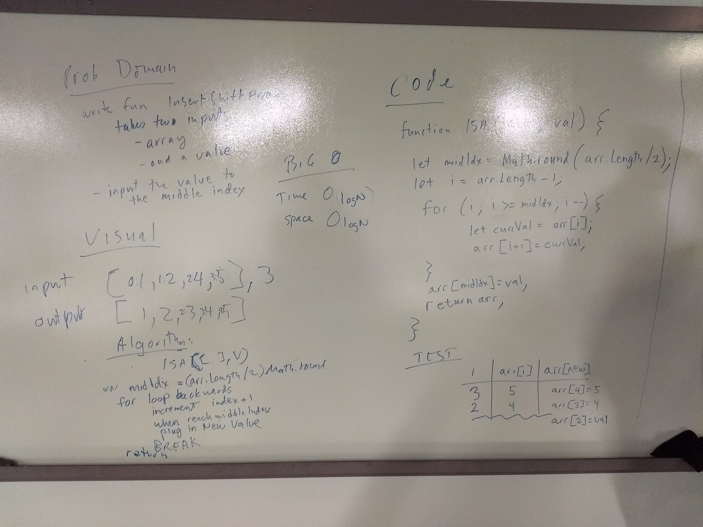

### Task List
- [x] Create GitHub repo
- [x] Build out file structure
- [x] Whiteboard 
- [x] Write actual code
- [x] Photograph image of whiteboard
- [x] Fill out README.md
- [x] npm init -y
- [x] npm install jest, eslint
- [x] package.json scripts added
- [x] Add test framework and tests.
- [x] All tests passing including lint
- [x] Passes Travis CI build
- [x] Create pull request
- [x] Submit URL of PR to submit the task to Canvas

# Array Binary Search -- Code Challenge 3
<!-- Short summary or background information -->
Write a function that takes an ordered array and a search key as input. Without utilizing any of the built-in methods, return the index of the array’s element that is equal to the search key, or -1 if the element does not exist.

## Challenge
<!-- Description of the challenge -->
The challenge is to avoid using built in array methods, and to search in a binary way.

## Solution
<!-- Embedded whiteboard image -->
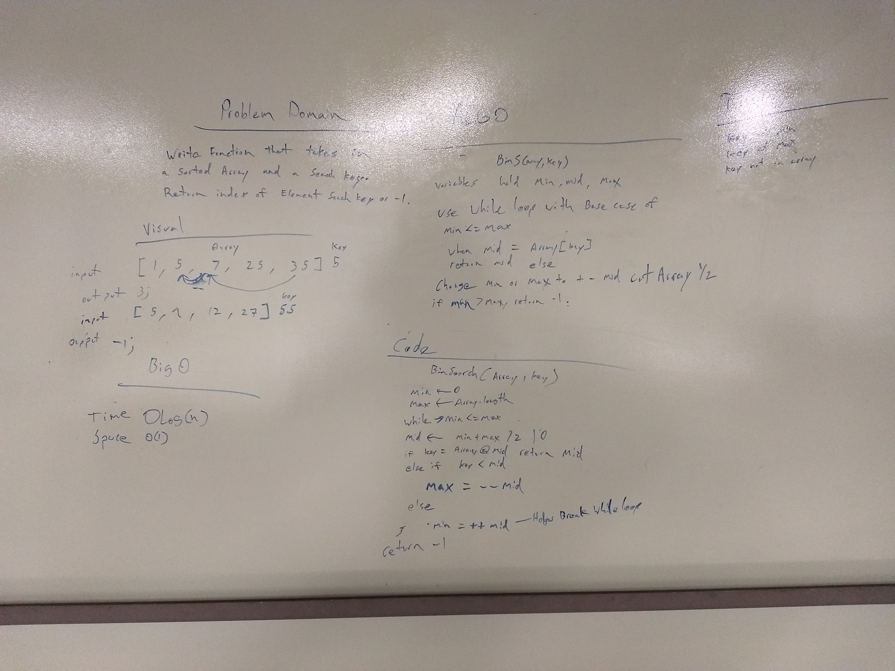

### Task List
- [x] Create GitHub repo
- [x] Build out file structure
- [x] Whiteboard 
- [x] Write actual code
- [x] Photograph image of whiteboard
- [x] Fill out README.md
- [x] npm init -y
- [x] npm install jest, faker, eslint
- [x] package.json scripts added
- [x] Add test framework and tests.
- [x] All tests passing including lint
- [x] Passes Travis CI build
- [x] Create pull request
- [ ] Submit URL of PR to submit the task to Canvas

# Linked List insert methods -- Code Challenge 6
This branch is passing tests on Travis:

<!-- Short summary or background information -->
Write three methods on your linked list class: append, insertBefore, and insertAfter.

## Solution
<!-- Embedded whiteboard image -->
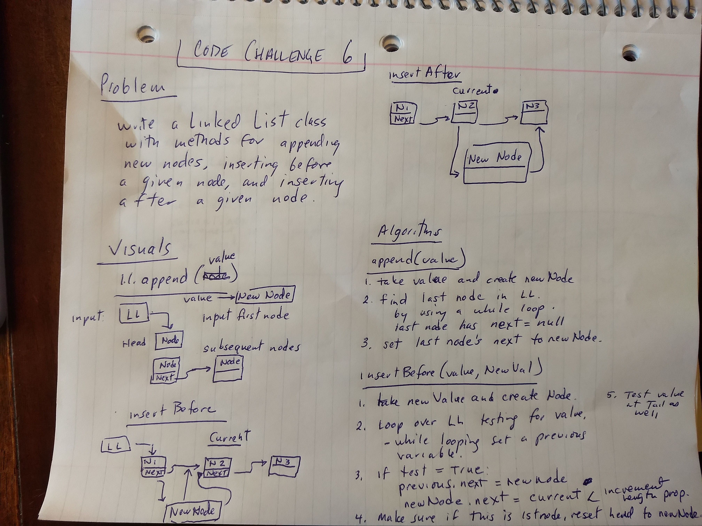 
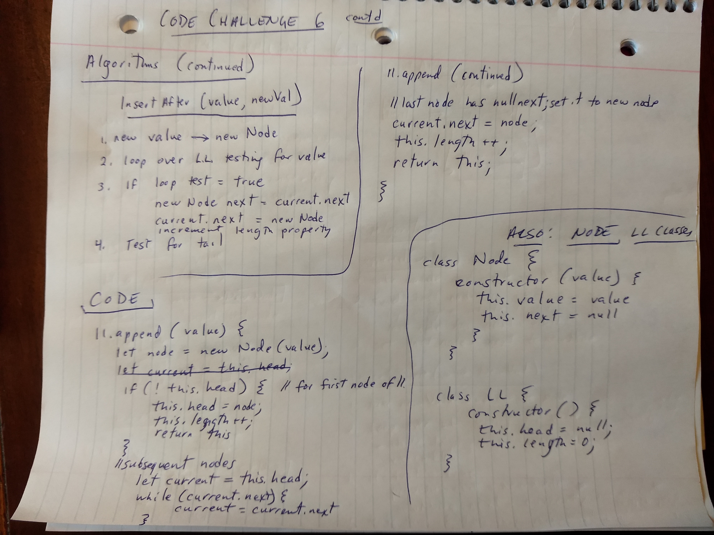 
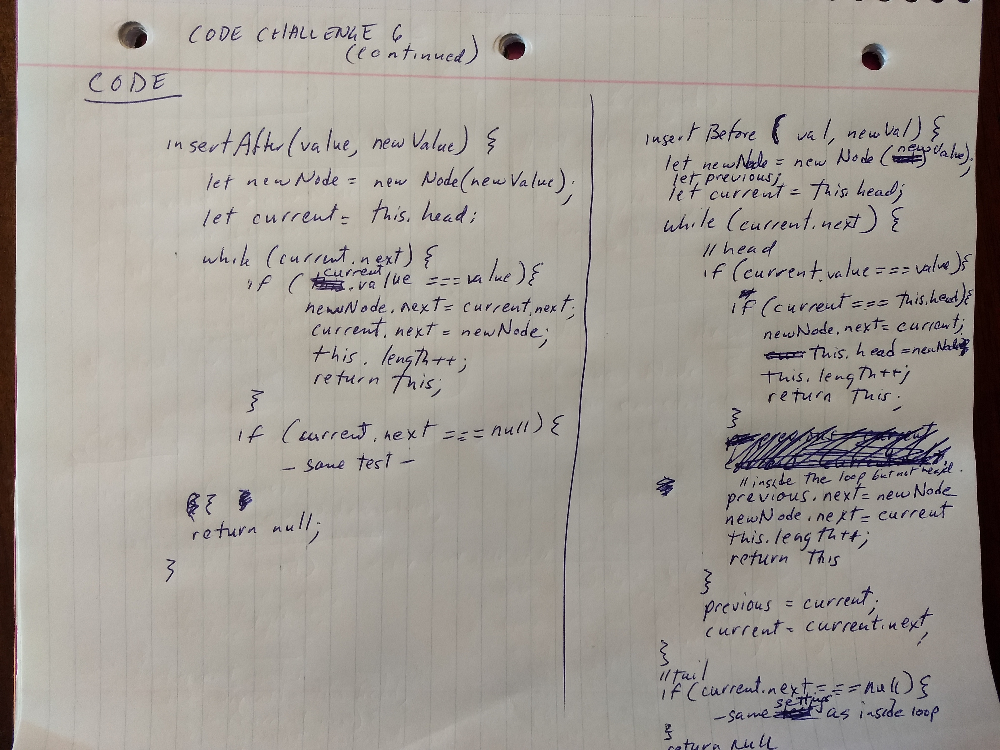 

### Task List
- [x] Create GitHub repo
- [x] Build out file structure
- [x] Whiteboard 
- [x] Write actual code
- [x] Photograph image of whiteboard
- [x] Fill out README.md
- [x] npm init -y
- [x] npm install jest, faker, eslint
- [x] package.json scripts added
- [x] Add test framework and tests.
- [x] All tests passing including lint
- [x] Passes Travis CI build
- [x] Create pull request
- [ ] Submit URL of PR to submit the task to Canvas

# Linked List k from the end -- Code Challenge 7
This branch is passing tests on Travis:

<!-- Short summary or background information -->
Write a method on your linked list class that takes a number k as a paremeter, and returns the value of the node k from then end of the linked list.

## Solution
<!-- Embedded whiteboard image -->
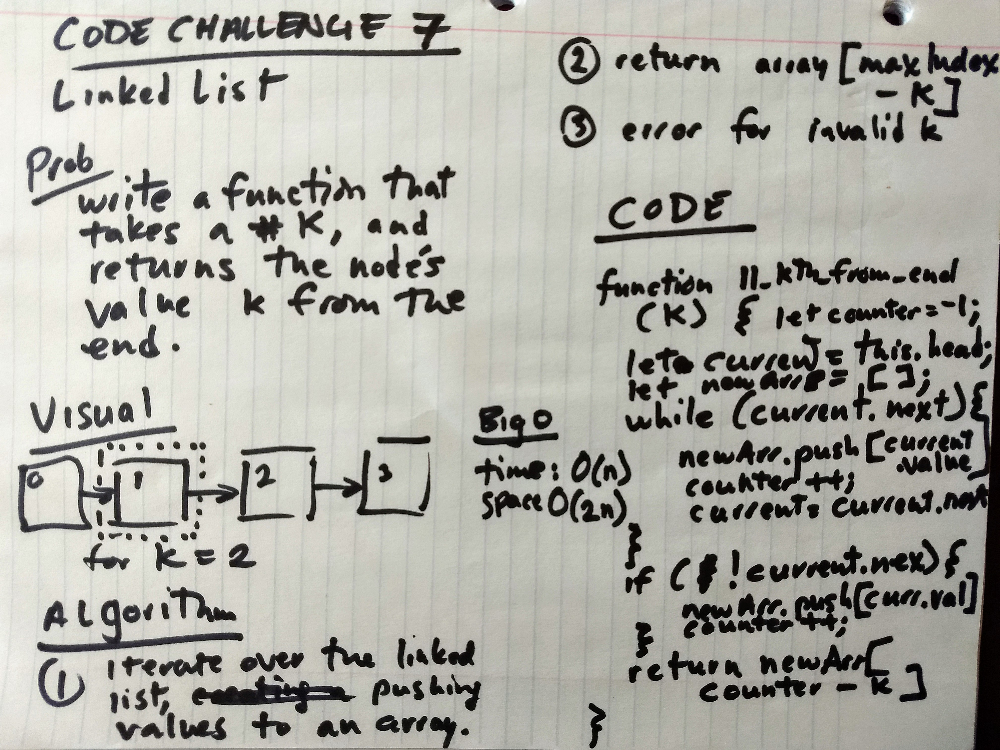 

### Task List
- [x] Create GitHub repo
- [x] Build out file structure
- [x] Whiteboard 
- [x] Write actual code
- [x] Photograph image of whiteboard
- [x] Fill out README.md
- [x] npm init -y
- [x] npm install jest, faker, eslint
- [x] package.json scripts added
- [x] Add test framework and tests.
- [x] All tests passing including lint
- [x] Passes Travis CI build
- [x] Create pull request
- [ ] Submit URL of PR to submit the task to Canvas

# Stacks and Queues
Passing CI tests on Travis CI:

<!-- Short summary or background information -->
Built out Stack and Queue classes, which wrap our linked-list data structure.

## Challenge
<!-- Description of the challenge -->
Build Stacks and Queues, using Linked Lists as the underlying data structure.

## Solution
<!-- Embedded whiteboard image -->
No white board required for this challenge.

### Task List
- [x] Create GitHub repo
- [x] Build out file structure
- [x] Whiteboard
- [x] Write actual code
- [x] Photograph image of whiteboard
- [x] Fill out README.md
- [x] npm init -y
- [x] npm install jest, faker, eslint
- [x] package.json scripts added
- [x] Add test framework and tests.
- [x] All tests passing including lint
- [x] Passes Travis CI build
- [x] Create pull request
- [x] Submit URL of PR to submit the task to Canvas

# Queues With Stacks
Passing CI tests on Travis:

## Challenge
<!-- Description of the challenge -->
Build a Queue using Stacks as its underlying data structure.

## Solution
<!-- Embedded whiteboard image -->
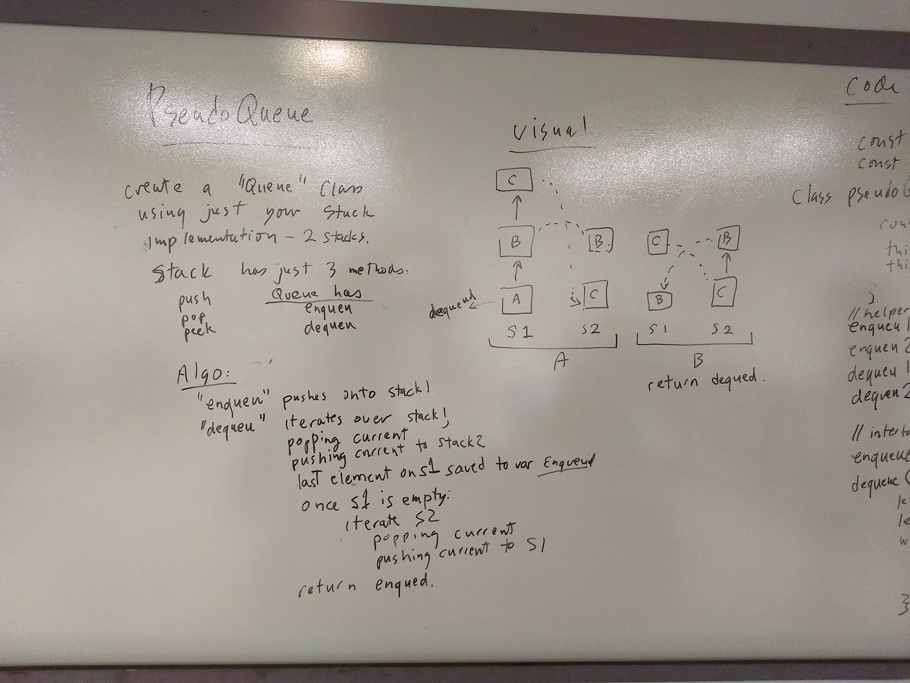 
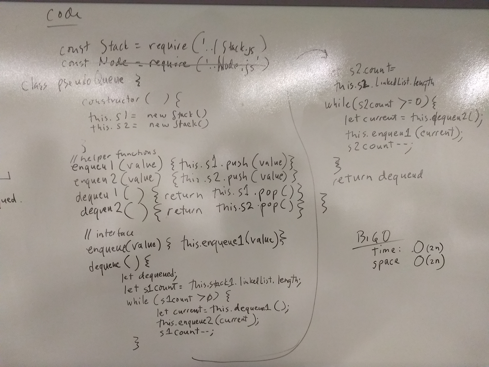 

### Task List
- [x] Create GitHub repo
- [x] Build out file structure
- [x] Whiteboard
- [x] Write actual code
- [x] Photograph image of whiteboard
- [x] Fill out README.md
- [x] npm init -y
- [x] npm install jest, faker, eslint
- [x] package.json scripts added
- [x] Add test framework and tests.
- [x] All tests passing including lint
- [x] Passes Travis CI build
- [x] Create pull request
- [x] Submit URL of PR to submit the task to Canvas

# FIFO Animal Shelter
<!-- Short summary or background information -->
An animal shelter takes in animals. And gives them out to new pet owners. A pet owner can prefer a dog or a cat, have no preference, or prefere a different animal such as a bird. If the pet owner would like a dog or a cat, find the dog or cat, if any, that has been in the shelter the longest. Otherwise, give them the animal that has been in the shelter the longest.

## Challenge
<!-- Description of the challenge -->
Using FIFO queues, return the desired animal. You can't necessarily just return the animal at the front of the queue though.

## Solution
<!-- Embedded whiteboard image -->
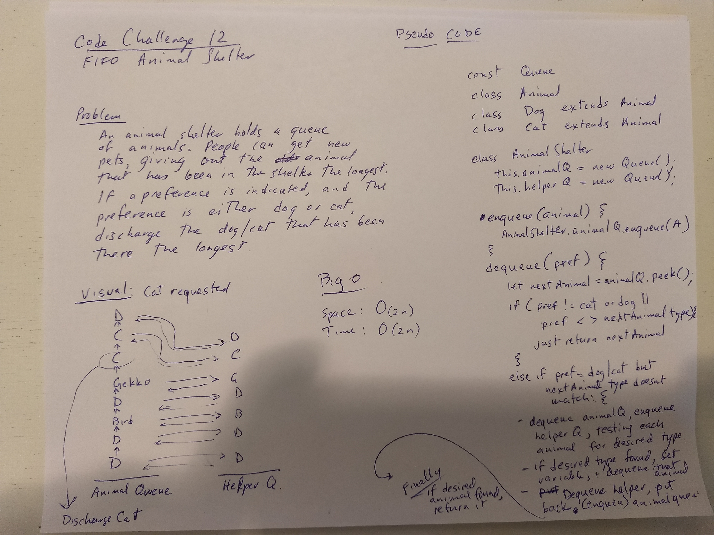 

### Task List
- [x] Create GitHub repo
- [x] Build out file structure
- [x] Whiteboard
- [x] Write actual code
- [x] Photograph image of whiteboard
- [x] Fill out README.md
- [x] npm init -y
- [x] npm install jest, faker, eslint
- [x] package.json scripts added
- [x] Add test framework.
- [] Add tests.
- [] All tests passing including lint
- [] Passes Travis CI build
- [x] Create pull request
- [x] Submit URL of PR to submit the task to Canvas

# Multi Bracket Validation -- Code Challenge 13

Please note that tests for Multi Bracket Validation are passing. 

<!-- Short summary or background information -->
Write a method that tests whether a string with brackets {},[],() has all matching brackets, or not. Method takes a string and returns a boolean.

## Solution
<!-- Embedded whiteboard image -->
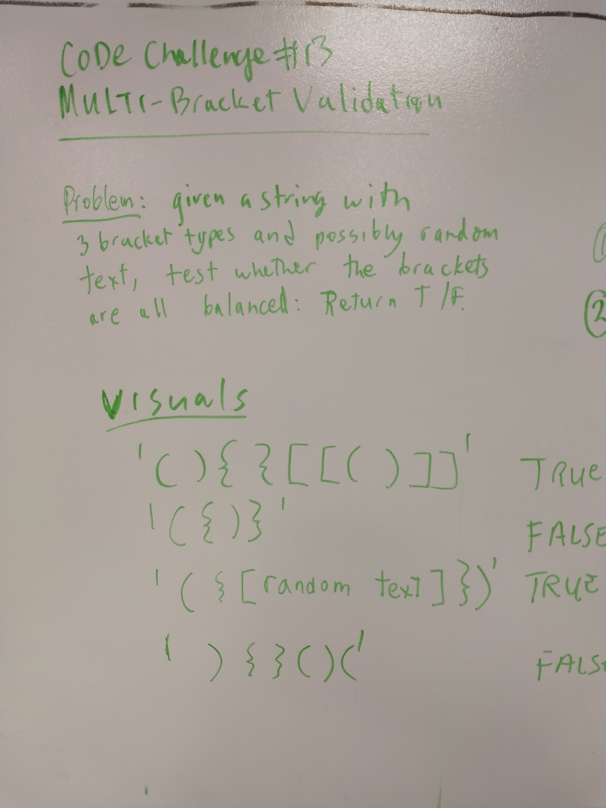 
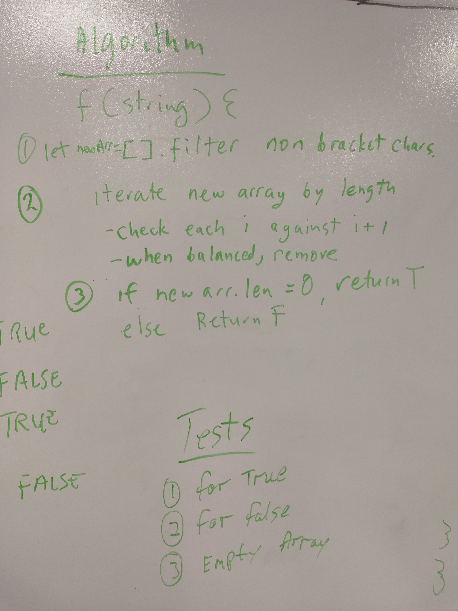 
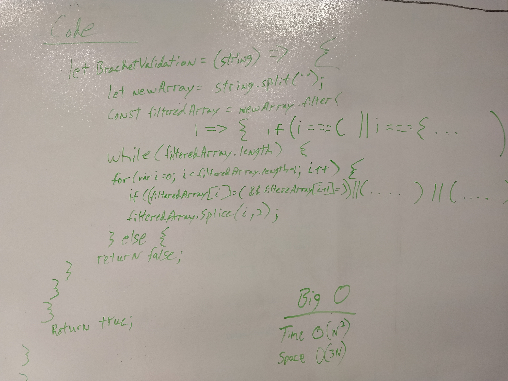 

### Task List
- [x] Create GitHub repo
- [x] Build out file structure
- [x] Whiteboard 
- [x] Write actual code
- [x] Photograph image of whiteboard
- [x] Fill out README.md
- [x] npm init -y
- [x] npm install jest, faker, eslint
- [x] package.json scripts added
- [x] Add test framework and tests.
- [x] All tests passing including lint
- [x] Passes Travis CI build
- [x] Create pull request
- [x] Submit URL of PR to submit the task to Canvas

